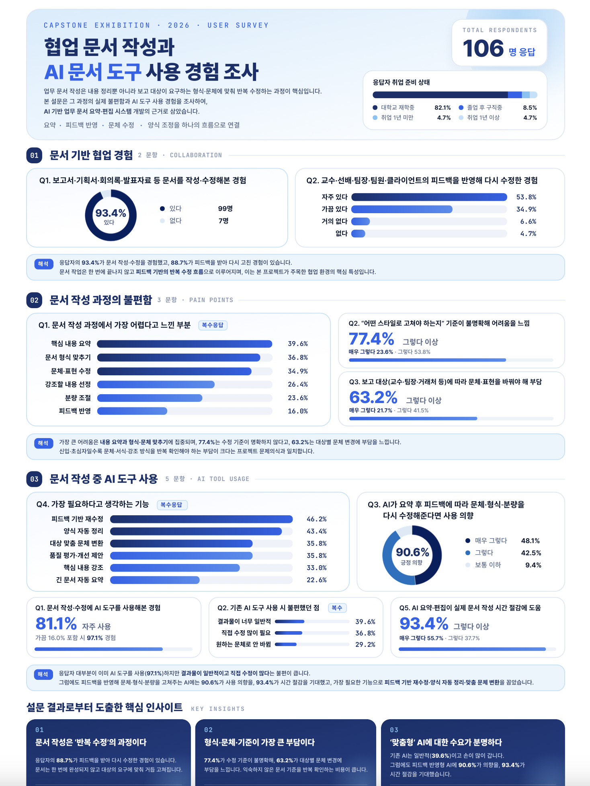
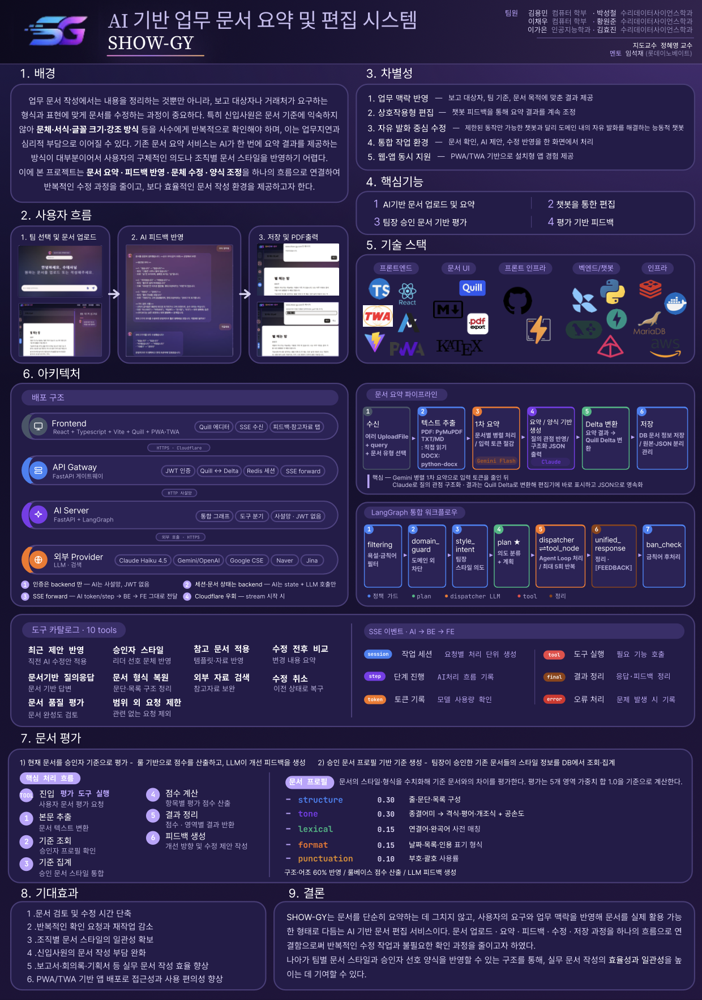
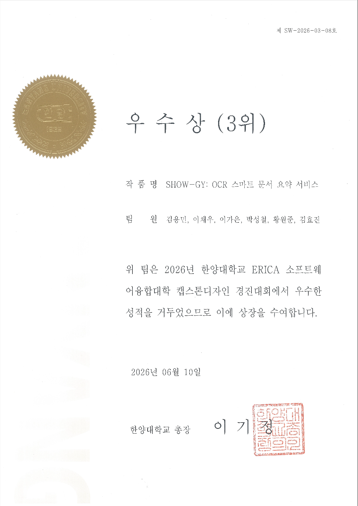

# **SHOW-GY**
🔗[Backend](https://github.com/SHOW-GY/show-gy-backend), [ChatBot](https://github.com/SHOW-GY/show-gy-AI), [Admin](https://github.com/SHOW-GY/show-gy-admin), [Frontend](https://github.com/SHOW-GY/show-gy-frontend)

## <**롯데 이노베이트 - 기업 연계**> 
- 팀장 1명(본인), 팀원 5명, 멘토님 1명
- 팀장 입장에서 수행한 업무와 진행 사항 위주로 작성되었습니다.

## 📌 프로젝트 개요

<**개요**>
- 업무 문서 작성에서는 내용을 정리하는 것뿐만 아니라, 보고 대상자나 거래처가 요구하는 형식과 표현에 맞게 문서를 수정하는 과정이 중요하다.
- 특히 신입사원은 문서 기준에 익숙하지 않아 문체·서식·글꼴 크기·강조 방식 등을 사수에게 반복적으로 확인해야 하며, 이는 업무지연과 심리적 부담으로 이어질 수 있다.
- 기존 문서 요약 서비스는 AI가 한 번에 요약 결과를 제공하는 방식이 대부분이어서 사용자의 구체적인 의도나 조직별 문서 스타일을 반영하기 어렵다.
- 이에 본 프로젝트는 문서 요약 · 피드백 반영 · 문체 수정 · 양식 조정을 하나의 흐름으로 연결하여 반복적인 수정 과정을 줄이고, 보다 효율적인 문서 작성 환경을 제공하고자 한다.

<**기간**>
- 2025.07-09 : 시장 조사, 설문 조사, 기획 
- 2025.10-12 : 학기 진행 및 기본적인 백엔드 CRUD등의 코드 작성
- 2026.01-02 : LangGraph 기반의 챗봇 코드 작성
- 2026.03 : 챗봇 코드와 프론트 코드 사이의 연결 진행
- 2026.04-05 : 룰베이스 챗봇의 문제점 발견 후 리팩토링 및 아키텍처 변경 진행
- 2026.06 : 발표 준비 및 엣지 케이스 기반으로 코드 수정

<**인원**>
- 인원 : 백엔드 2명, 프론트 2명, AI 2명

<**맡은 역할**>
- **기획** : 회의 진행 및 주제 선정, UX 구조 변경
- **PM** : 회의 일정 관리 및 프로젝트 일정 관리를 통한 목표 관리
- **백엔드** : CRUD 구현, N+1문제 등의 호출 로직 점검, ERD 기획, 문서 편집 및 문서 관리 파이프라인 설계, 문서 버전의 일관성 문제 해결, 요약 서비스 시의 발생 문제 (순차 방식으로 인한 시간 문제, 토큰 사용량 증가) 등의 해결, 의존성 분리 (DI구조 작성), 에러 체리, DB FK 대신 관계 관리 테이블 형태 변경
- **AI 챗봇** : Langgraph를 통한 문서 편집 챗봇 아키텍처 설계, 룰 베이스 챗봇의 형태 변경 - langchain을 통한 tool 호출 형태 변경, RedisSavor를 통한 대화 내역 관리
- **CI/CD** : 백엔드와 챗봇의 Docker와 Jenkin, github를 통한 CI / CD 구축, Ec2 Static IP와 Gabia 등을 통한 구체적인 설정

<**핵심 기능**>
- 여러 문서를 양식과 내용으로 구분 지어 새로운 문서 요약 생성
- AI 챗봇을 통한 문서 수정 (문서 수정에 영향을 주는 문서 : 내부 승인 문서, 외부 API를 통한 문서 검색)
- 팀 단위의 문서 작성, 승인 대기, 승인 완료 문서롤 구분 지은 문서 관리 서비스
- 팀장이 지정할 수 있는 Ban_Word, Ban_Context 등을 통한 문서 피드백 서비스

## 🏗 아키텍처 및 프레임워크 정리
- <**Backend**> : FastAPI
- <**Infra**> : Redis, MariaDB, AWS (EC2, SES), Docker
- <**CI/CD**> : Jenkins
- <**AI(ChatBot)**> : LangGraph / LangChain, Claude SDK, JinaAI, Google Search Engine
- <**Frontend**> : React, Quill Editor

## **기술적 도전과 해결**
- 자유 발화와 룰베이스 챗봇
- 문서 확장자 별 자유도 높은 레이아웃의 호환성
- Claude API의 토큰 문제
- 순차적 Claude API 호출로 인한 시간 증가
- 문서 일관성 유지
- 대화 내역 유지

## **회고**
- **팀장** : 누구에게나 장점과 단점이 공존하고 장점을 살려주고 단점을 보완하여 모든 사람들이 자신의 말을 할 수 있도록 이끌어 주는 것이 팀장의 영역이라고 생각한다. 그렇기에 나는 제대로 된 팀장인가 생각을 해봤을 때 아니었던 것 같다. 단순히 자유로운 기술적 도전을 보장하기 위하여 많은 개발을 도맡아서 하고 완성까지 끌고 갔지만, 개발의 전반을 이끄는 입장에서 다른 팀원들이 과연 내가 이해한 것과 같은 방향과 깊이로 프로젝트를 이해했는지 성찰하게 되고, 나는 그것을 위해서 노력하였는지 다시 한 번 생각하게 되었다. 모두가 많은 의견을 내고 그들의 의견이 반영되면 좋겠다는 생각과 함께 리팩토링과 추상화를 심도 있게 고민하고 각자에게 일을 배분하려 노력하였으나, 전체 그림을 모르는 입장에선 쉽사리 무언가를 하자고 제안하기 어렵고 그 일로 인한 모든 책임이 자신에게 있는 것이 아니므로 어렵지 않았을까 생각이 든다. 나는 팀장이 헌신적이어야 한다고 생각한다. 그 헌신은 공동의 목표로 향한다. 나는 그들에게 충분히 헌신적인 팀장이었을까. 아니면 나의 개인의 목표를 위한 팀장이었을까 고민하게 된다.   

- **기획 / PM** : 문제를 정의하는 일은 쉽지 않은 일이다. 나는 기획의 진행을 이끌고, 전반의 방향을 주도 하였으나, 항상 주도 당하는 입장에서만 경험하고 처음으로 겪은 팀장 + 기획 등등의 역할로 인하여 올바르게 정의했는가 고민하게 된다. 항상 느끼는 생각은 다시 한 번, 또 다른 기회가 주어진다면, 등의 생각이 든다. 또한 PM의 일정 진행 등을 관리하기 위한 많은 도구가 있다. Jira, Slack, Notion 등등이 있지만 이러한 기술을 사용해보지 않은 팀원들의 입장에선 이 모든 것이 부담이지 않았을까 생각이 든다. 그렇기에 Notion에 Jira의 방식을 사용하여 브랜치 넘버를 정하고 구체적인 브랜치 마다의 설명을 관리하여 일을 정리하였으나 이 또한 매우 아쉽게만 느껴진다. 또한 기획적인 부분 중 문서의 편집이 Quill에디터를 위한 Delta 형식, 확장자 별로 다른 레이어와 추출 로직 등을 추상화 코드를 이용하여 충분히 관리가 가능할 것이라 생각하였다. 하지만, 이 부분에 대하여 명확히 설명을 공유하지 않은 것이 조금은 구현의 아쉬움으로 남고 있고, 실제로 이 부분은 학부생이 한 학기 개발 과정 동안 매달릴 양도 아니었다는 생각이 든다. 그렇기에 너무 어려운, 분량이 많은 주제를 골랐다는 생각이 들고 이 부분도 우리 팀원들에게 부담을 쥐어준 것이 아닌가 하는 생각이 든다.   

- **백엔드** : 보안 인증은 매우 중요하다. 하지만 최우선 과제는 아니다. JWT 토큰과 쿠키 관리 등의 인증 / 인가 코드를 가장 먼저 작성 했다. 하지만 지금 생각하는 시점에서 이게 과연 MVP를 작성하는 입장에서 가장 먼저 구현했어야 하는 것인가 라는 생각이 든다. 이로 인하여 일반 API 호출 테스트에서 JWT를 무시하거나 다시 살리는 등의 과정이 추가 되었다. 또한 이번 기회로 커스텀 에러의 상속 에러의 범위와 HTTP 에러, 내부 인프라 에러 등의 FastAPI 혹은 다른 백엔드 프레임워크로 구현하는 과정에서의 신경써야 할 여러 부분들에 대해서 다시 학습하는 과정을 경험하게 되었고, 다른 코드 분량이 방대하여 백엔드를 좀 더 깊이 있게 파지 못한 것이 조금은 아쉽게 느껴진다.
  
- **챗봇** : 가장 회고에서 핵심으로 적고 싶고, 지금의 개발에 대한 생각을 유지하게 된 부분이라고 생각을 한다. 우리가 해결해야 하는 문제는 무엇이었나. 도메인은 문서라는 한정된 도메인이지만, Input으로 들어오게 되는 것은 자유 발화였다. 그렇기 때문에 자유 발화를 들어오게 할 것이라는 기획이 들어온 시점으로 부터 우리의 챗봇은 우리 도메인에 해당하는 모든 종류의 자유 발화를 해결해야만 했다. 하지만 나는 이것을 구현하는 과정에서 랭그래프를 통한 룰 베이스 챗봇을 구현했다. 설계 철학 자체가 오류였다. 이후 한달 정도 남은 시점에 랭그래프로 얽혀 있던 코드들을 랭그래프는 필터의 역할만을 제한적으로 유지하며 그래프의 특성을 살리고 랭체인을 통한 자유 발화 처리와 사용자의 의도에 맞는 처리로 툴 형태로 리팩토링하여 챗봇 변경을 진행하였고 우리가 원하는 우리 도메인 내에서 자유 발화 처리가 가능한 그런 챗봇의 형태로 변경을 하였다. 이 부분에서 굉장히 많은 시간적인 자원이 들어갔고 다른 서비스의 안정적인 처리에 조금 더 노력하지 못했다는 것이 아쉽게만 느껴졌다. 나는 개발을 잘하는 개발자도 멋지다고 생각하지만, 무엇보다 우리가 처리해야 할, 해결해야 할 문제는 무엇인지 누구보다 예리하게 파고들 수 있는 개발자가 아름답다고 생각한다. 그런 개발자를 지향하게 된 계기가 되었고, 단순히 어떤 기술을 사용할까 보다 이 기술을 왜 사용해야 하는 지를 생각하는 개발자를 지향하게 된 계기가 된 것 같다.  

## 증빙 자료 및 발표 자료
<**설문 조사**>

<**발표 자료**>

<**성과**>

